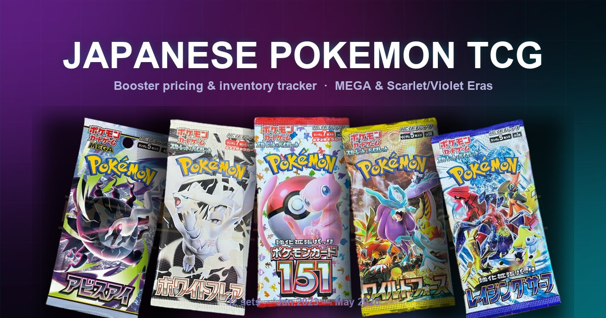

# Japanese Pokemon TCG — Booster Pricing Tracker

A self-hosted price and inventory tracker for Japanese Pokemon TCG booster sets (MEGA Era and Scarlet & Violet Era — 32 sets, January 2023 to May 2026). Edit buy price (¥), sell price (€), and stock count per set; changes sync live to Supabase so the same numbers show up across devices.



## Stack

- **Static HTML page** — one file, no framework, no bundler.
- **Supabase** (`prices` table) — shared key/value store for the input values, accessed directly from the client with the anon key + RLS.
- **Vercel** — primary deploy. GitHub Pages workflow kept as a backup.

Sources:
- Booster pack images: scraped once from [japan2uk.com](https://www.japan2uk.com) and committed locally; a CSS mask hides the shop watermark in the margins.
- Set logos: [Serebii](https://www.serebii.net) with [TCGdex](https://tcgdex.net) fallback.

## Quick start

```bash
git clone https://github.com/lucsortiz/japanese-pokemon-tcg.git
cd japanese-pokemon-tcg
npx serve -p 4444 .        # or `python -m http.server 4444`
open http://localhost:4444
```

The page renders immediately. Supabase sync needs the placeholders substituted — see [AGENTS.md](AGENTS.md#local-dev) for the one-liner.

## Project layout

```
index.html      The whole app (HTML + scoped CSS + inline JS).
boosters/       32 booster pack PNGs.
og-image.jpg    Social link preview (1200×630).
build.mjs       Substitutes __SUPABASE_URL__ / __SUPABASE_ANON_KEY__ / __SITE_URL__.
vercel.json     Vercel build config.
.github/        GitHub Pages backup deploy workflow.
AGENTS.md       Conventions and common tasks (for both AI agents and humans).
```

## Deploying your own

1. Fork / clone the repo.
2. In Supabase, create a `prices` table:
   ```sql
   create table prices (
     key   text primary key,
     value numeric not null default 0
   );
   alter table prices enable row level security;
   create policy "public read"  on prices for select using (true);
   create policy "public write" on prices for all    using (true);
   ```
3. Import the repo into Vercel (Framework Preset: Other).
4. Add two environment variables in the Vercel project:
   - `SUPABASE_URL` — your project URL from Supabase → Settings → API
   - `SUPABASE_ANON_KEY` — the anon public key from the same page
5. (Optional) Add `SITE_URL=https://yourdomain.com` if you bind a custom domain — improves social link previews.

Push to `main` → Vercel rebuilds → done.

## License

Personal/hobby project. Pokemon, Pokemon TCG, and all booster art are trademarks of The Pokemon Company / Nintendo / GAME FREAK / Creatures.
